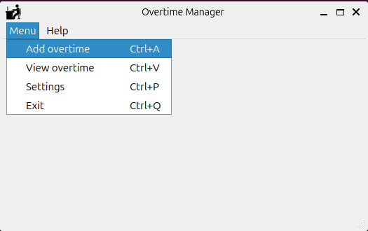
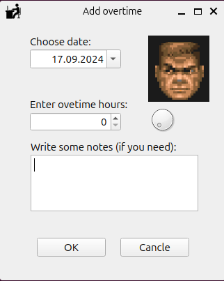
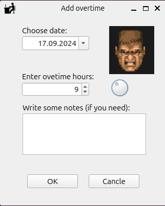
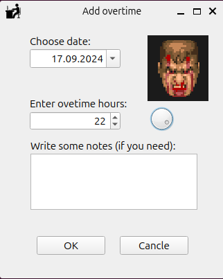
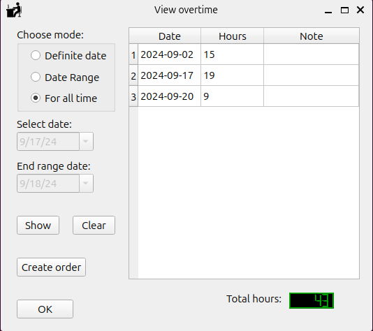

# Overtime Manager
### Overview
**Overtime Manager** is a cross-platform desktop application designed to help users track and manage their overtime hours. The application allows users to add, view, and manage overtime records for specific dates or date ranges. It is built with **PyQt5**, providing a user-friendly graphical interface, and can be run directly from the terminal without installation.

### Features
- Add Overtime: Users can log overtime hours for specific dates.
- View Overtime Records:
    - By a specific date
    - By a specific date range
    - View all overtime records

- Cross-platform: Runs on Linux, Windows, and macOS.
- No installation required: Simply run the main.py script to use the application.

### Requirements
- Python 3.x
- PyQt5

#### Install Dependencies
To install the required dependencies, run the following command in your terminal:

```bash
pip install PyQt5
```
#### Running the Application
After installing the required dependencies, you can run the application directly from the terminal:

```bash
python main.py
```

#### Usage
- Add Overtime: Enter the date and number of overtime hours to log them.
- View Overtime Records:
    - View overtime for a specific date.
    - View overtime for a specific date range.
    - View all overtime records at once.

#### Platform Support
- Linux
- Windows
- macOS

#### Screenshots
**Main menu:**


**Ovetime adding window:**





**Overtimes records view:**

